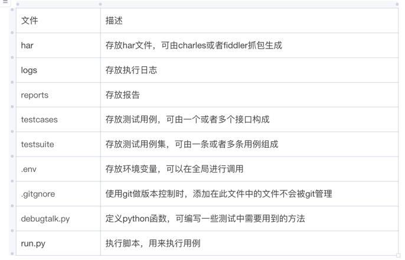
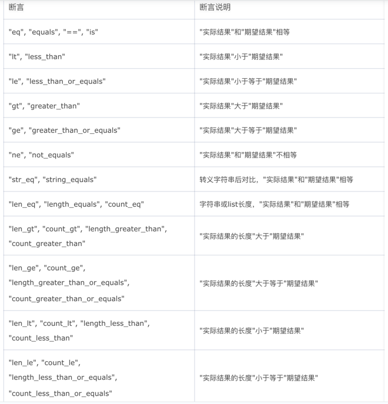

# teleinfo接口自动化测试框架

## 1，该项目用于teleinfo接口自动化测试，可用于项目测试准入、准出，线上监控，回归测试等

## 2，该项目使用httprunner作为基础框架，融合和pytest和allure，支持yaml,json和pytest三种格式的用例，支持录制脚本，可以在线生成报告，  在框架的基础上增加了一些使用方法以及运行脚本,对于接口功能的验证，该框架可以满足大部分接口自动化测试的要求，但是对于一些需要循环调用或者是轮训的接口，该框架暂时不能很好的使用

## 3，安装说明：此框架的基础组件为httprunner，pytest和allure，因此需要对这三个组件进行安装

### （1）httprunner需要使用pip进行安装，安装指令为pip install httprunner，也可进行指定版本安装，安装指令为pip install httprunner==3.1.6，其中3.1.6为版本号，安装完成后可以使用pip show httprunner进行已安装版本查看，也可以使用httprunner -h查看帮助信息

### （2）安装pytest，使用pip进行安装，安装指令为pip install pytest

### （3）安装allure，对于Windows系统，需下载allure最新版本[https://github.com/allure-framework/allure2/releases]()，安装后在环境变量中配置allure的安装路径；对于mac系统，可以使用brew进行安装，安装指令为brew install allure，也可先下载allure到本地，完成安装后配置bin目录到环境变量文件中

### （4）安装allure-pytest插件，安装指令为pip install allure-pytest

## 4，使用说明

### （1）项目目录说明：

### （2）接口用例编写：

`config:`  

    name: 百度搜索  #用例名称，可修改为自己的用例名称
    base_url: ${ENV(HOST)} #全局url  
    variables: {}  #变量，测试用例的配置项，可作用于整个用例 
    verify: false  #不是必须的，可选，指定是否验证服务器的TLS证书，如果没有设置verify或将其设置为True，则会发生SSLError 
`teststeps:  #测试步骤`  
`-   name: 百度搜索  #测试步骤名称，可修改为自己的测试用例步骤名称` 
`    request:  #请求信息`
`        cookies:`  

            BAIDUID: 5D7168F0F45A749F0EFBA6BC33B895D7:FG=1
            BAIDUID_BFESS: 5D7168F0F45A749F0EFBA6BC33B895D7:FG=1
            BA_HECTOR: 250h040g212h8ka1ahal2g0i1ia4d201o
            BDORZ: B490B5EBF6F3CD402E515D22BCDA1598
            BDSFRCVID: K3DOJeC62xBLqAvf7cHVrr7S8sFeuPnTH6aoRaQvSNTJrLhIXxKBEG0Ppf8g0K4M9dGBogKK0mOTHv-F_2uxOjjg8UtVJeC6EG0Ptf8g0f5
            BDSFRCVID_BFESS: K3DOJeC62xBLqAvf7cHVrr7S8sFeuPnTH6aoRaQvSNTJrLhIXxKBEG0Ppf8g0K4M9dGBogKK0mOTHv-F_2uxOjjg8UtVJeC6EG0Ptf8g0f5
            BDSVRTM: '179'
            BD_CK_SAM: '1'
            BD_HOME: '1'
            BD_UPN: '123253'
            BIDUPSID: A44F5199DB83346FBFE019AE09043A28
            COOKIE_SESSION: 410897_0_5_5_12_6_1_0_5_5_0_0_539_0_0_0_1687938819_0_1688351833%7C9%231282160_53_1686626265%7C9
            H_BDCLCKID_SF: JbF8VI8KfIvHebDk-4QEbbQH-UnLqb_tX2OZ0l8KtqjTSlFmhPjMjtA_KlKfQhtjaNTrLbomWIQHDpQtypK25qTb54RUtUjBWer4KKJxtUKWeIJo5DcYqfD4hUJiB5OLBan7Lj6IXKohJh7FM4tW3J0ZyxomtfQxtNRJ0DnjtnLhbC-6j6-hejQBepJf-K6O2C6yBn785-OsfjrnhPF33bL0XP6-35KHMgrr0R7m5qFVSRbHW-bJqtFzbqoT2q37JD6yQMcm-l6RVMLR-n3zWbkUb4oxJpOj5JbMopk2BCTfspovbURvD-ug3-7qex5dtjTO2bc_5KnlfMQ_bf--QfbQ0hOhqP-j5JIEoKK-JI02hKLrbDTWMt_eMMnXKbJ3b4o2WbCQMnAM8pcNLTDKLjKfy4OZKfIL2e64hnOjHCTqqfOJjlO1j4_eW-nyt4ke3m3C24nablnfVq5jDh3i3jksD-RCW4R8-bcy0hvctn6cShnCqfjrDRLbXU6BK5vPbNcZ0l8K3l02V-bIe-t2b6QhDN_JJjLfJJCsL-35HJoHjJbGq4bohjPNQ-O9BtQmQnTxoIIE5PotEt3y5R5Kjpt9QHjqWnKtQNnTBJOmLD5aOCtmLROBLpKShfrL0x-jLTnh-666bnvY_p5j0PnJyUnQhtnnBpQt3H8HL4nv2JcJbM5m3x6qLTKkQN3T-PKO5bRu_CF2JKL5MDIGj6Rb5nbH2MrK2-vyaDveBPK8Kb7VbpkRQMnkbfJBDl7GWnoCbDFf3hnC-t_bVInRQ4oh0-C7yajK2hjKL6cg2fbF-qRsOfn9yU5pQT8rKMDOK5OiJgD80p3Pab3vOIJzXpO15CuzBN5thURB2DkO-4bCWJ5TMl5jDh3Mb6ksDMDtqtJHKbDD_I_aJxK
            H_BDCLCKID_SF_BFESS: JbF8VI8KfIvHebDk-4QEbbQH-UnLqb_tX2OZ0l8KtqjTSlFmhPjMjtA_KlKfQhtjaNTrLbomWIQHDpQtypK25qTb54RUtUjBWer4KKJxtUKWeIJo5DcYqfD4hUJiB5OLBan7Lj6IXKohJh7FM4tW3J0ZyxomtfQxtNRJ0DnjtnLhbC-6j6-hejQBepJf-K6O2C6yBn785-OsfjrnhPF33bL0XP6-35KHMgrr0R7m5qFVSRbHW-bJqtFzbqoT2q37JD6yQMcm-l6RVMLR-n3zWbkUb4oxJpOj5JbMopk2BCTfspovbURvD-ug3-7qex5dtjTO2bc_5KnlfMQ_bf--QfbQ0hOhqP-j5JIEoKK-JI02hKLrbDTWMt_eMMnXKbJ3b4o2WbCQMnAM8pcNLTDKLjKfy4OZKfIL2e64hnOjHCTqqfOJjlO1j4_eW-nyt4ke3m3C24nablnfVq5jDh3i3jksD-RCW4R8-bcy0hvctn6cShnCqfjrDRLbXU6BK5vPbNcZ0l8K3l02V-bIe-t2b6QhDN_JJjLfJJCsL-35HJoHjJbGq4bohjPNQ-O9BtQmQnTxoIIE5PotEt3y5R5Kjpt9QHjqWnKtQNnTBJOmLD5aOCtmLROBLpKShfrL0x-jLTnh-666bnvY_p5j0PnJyUnQhtnnBpQt3H8HL4nv2JcJbM5m3x6qLTKkQN3T-PKO5bRu_CF2JKL5MDIGj6Rb5nbH2MrK2-vyaDveBPK8Kb7VbpkRQMnkbfJBDl7GWnoCbDFf3hnC-t_bVInRQ4oh0-C7yajK2hjKL6cg2fbF-qRsOfn9yU5pQT8rKMDOK5OiJgD80p3Pab3vOIJzXpO15CuzBN5thURB2DkO-4bCWJ5TMl5jDh3Mb6ksDMDtqtJHKbDD_I_aJxK
            H_PS_645EC: 3574QfyBV8S%2FLJA3EyvjVZy%2BsW6lYdQ%2FkMLOPBNTI4RAMjDJ0DxM0A9j%2F34
            H_PS_PSSID: '36543_38882_38957_38955_38960_38915_38801_38990_38640_26350'
            H_WISE_SIDS: '219946_219556_216843_213354_214805_219942_213043_230175_204905_110085_236308_244727_245411_243706_247146_250890_249892_253882_240590_254473_254590_254729_233835_254885_253212_253426_250882_255938_255979_253665_107314_256083_253989_256122_255661_255476_256348_256739_251973_257002_257081_257104_254075_257289_257338_257285_254317_251058_257454_255324_257543_257654_257662_257941_257167_257978_257903_257823_257586_257401_255224_253900_258193_258246_257996_258525_258471_258370_258642_258723_258729_256154_258814_258938_257303_258982_258958_258699_230288_259048_259037_252256_259190_259193_259255_256222_259214_259412_259287_259392_259431_211987_259569_259605_259624_256998_259558_259649_251785_259707_258772_258716_234295_234208_188333_259889_254299_255909_259052_254144'
            H_WISE_SIDS_BFESS: '219946_219556_216843_213354_214805_219942_213043_230175_204905_110085_236308_244727_245411_243706_247146_250890_249892_253882_240590_254473_254590_254729_233835_254885_253212_253426_250882_255938_255979_253665_107314_256083_253989_256122_255661_255476_256348_256739_251973_257002_257081_257104_254075_257289_257338_257285_254317_251058_257454_255324_257543_257654_257662_257941_257167_257978_257903_257823_257586_257401_255224_253900_258193_258246_257996_258525_258471_258370_258642_258723_258729_256154_258814_258938_257303_258982_258958_258699_230288_259048_259037_252256_259190_259193_259255_256222_259214_259412_259287_259392_259431_211987_259569_259605_259624_256998_259558_259649_251785_259707_258772_258716_234295_234208_188333_259889_254299_255909_259052_254144'
            MCITY: -%3A
            PSINO: '2'
            PSTM: '1665561648'
            WWW_ST: '1688352521005'
            ZFY: YTfqnqVD:BCOgPhgY89:A5rDo0XLmNfQyQjAwIQjdfMk8:C
            delPer: '0'
            sugstore: '1'
        headers:
            Accept: '*/*'
            Accept-Encoding: gzip, deflate, br
            Accept-Language: zh-CN,zh;q=0.9
            Connection: keep-alive
            Cookie: BIDUPSID=A44F5199DB83346FBFE019AE09043A28; PSTM=1665561648; BD_UPN=123253;
                sugstore=1; H_WISE_SIDS=219946_219556_216843_213354_214805_219942_213043_230175_204905_110085_236308_244727_245411_243706_247146_250890_249892_253882_240590_254473_254590_254729_233835_254885_253212_253426_250882_255938_255979_253665_107314_256083_253989_256122_255661_255476_256348_256739_251973_257002_257081_257104_254075_257289_257338_257285_254317_251058_257454_255324_257543_257654_257662_257941_257167_257978_257903_257823_257586_257401_255224_253900_258193_258246_257996_258525_258471_258370_258642_258723_258729_256154_258814_258938_257303_258982_258958_258699_230288_259048_259037_252256_259190_259193_259255_256222_259214_259412_259287_259392_259431_211987_259569_259605_259624_256998_259558_259649_251785_259707_258772_258716_234295_234208_188333_259889_254299_255909_259052_254144;
                H_WISE_SIDS_BFESS=219946_219556_216843_213354_214805_219942_213043_230175_204905_110085_236308_244727_245411_243706_247146_250890_249892_253882_240590_254473_254590_254729_233835_254885_253212_253426_250882_255938_255979_253665_107314_256083_253989_256122_255661_255476_256348_256739_251973_257002_257081_257104_254075_257289_257338_257285_254317_251058_257454_255324_257543_257654_257662_257941_257167_257978_257903_257823_257586_257401_255224_253900_258193_258246_257996_258525_258471_258370_258642_258723_258729_256154_258814_258938_257303_258982_258958_258699_230288_259048_259037_252256_259190_259193_259255_256222_259214_259412_259287_259392_259431_211987_259569_259605_259624_256998_259558_259649_251785_259707_258772_258716_234295_234208_188333_259889_254299_255909_259052_254144;
                BAIDUID=5D7168F0F45A749F0EFBA6BC33B895D7:FG=1; MCITY=-%3A; BDSFRCVID=K3DOJeC62xBLqAvf7cHVrr7S8sFeuPnTH6aoRaQvSNTJrLhIXxKBEG0Ppf8g0K4M9dGBogKK0mOTHv-F_2uxOjjg8UtVJeC6EG0Ptf8g0f5;
                H_BDCLCKID_SF=JbF8VI8KfIvHebDk-4QEbbQH-UnLqb_tX2OZ0l8KtqjTSlFmhPjMjtA_KlKfQhtjaNTrLbomWIQHDpQtypK25qTb54RUtUjBWer4KKJxtUKWeIJo5DcYqfD4hUJiB5OLBan7Lj6IXKohJh7FM4tW3J0ZyxomtfQxtNRJ0DnjtnLhbC-6j6-hejQBepJf-K6O2C6yBn785-OsfjrnhPF33bL0XP6-35KHMgrr0R7m5qFVSRbHW-bJqtFzbqoT2q37JD6yQMcm-l6RVMLR-n3zWbkUb4oxJpOj5JbMopk2BCTfspovbURvD-ug3-7qex5dtjTO2bc_5KnlfMQ_bf--QfbQ0hOhqP-j5JIEoKK-JI02hKLrbDTWMt_eMMnXKbJ3b4o2WbCQMnAM8pcNLTDKLjKfy4OZKfIL2e64hnOjHCTqqfOJjlO1j4_eW-nyt4ke3m3C24nablnfVq5jDh3i3jksD-RCW4R8-bcy0hvctn6cShnCqfjrDRLbXU6BK5vPbNcZ0l8K3l02V-bIe-t2b6QhDN_JJjLfJJCsL-35HJoHjJbGq4bohjPNQ-O9BtQmQnTxoIIE5PotEt3y5R5Kjpt9QHjqWnKtQNnTBJOmLD5aOCtmLROBLpKShfrL0x-jLTnh-666bnvY_p5j0PnJyUnQhtnnBpQt3H8HL4nv2JcJbM5m3x6qLTKkQN3T-PKO5bRu_CF2JKL5MDIGj6Rb5nbH2MrK2-vyaDveBPK8Kb7VbpkRQMnkbfJBDl7GWnoCbDFf3hnC-t_bVInRQ4oh0-C7yajK2hjKL6cg2fbF-qRsOfn9yU5pQT8rKMDOK5OiJgD80p3Pab3vOIJzXpO15CuzBN5thURB2DkO-4bCWJ5TMl5jDh3Mb6ksDMDtqtJHKbDD_I_aJxK;
                BDSFRCVID_BFESS=K3DOJeC62xBLqAvf7cHVrr7S8sFeuPnTH6aoRaQvSNTJrLhIXxKBEG0Ppf8g0K4M9dGBogKK0mOTHv-F_2uxOjjg8UtVJeC6EG0Ptf8g0f5;
                H_BDCLCKID_SF_BFESS=JbF8VI8KfIvHebDk-4QEbbQH-UnLqb_tX2OZ0l8KtqjTSlFmhPjMjtA_KlKfQhtjaNTrLbomWIQHDpQtypK25qTb54RUtUjBWer4KKJxtUKWeIJo5DcYqfD4hUJiB5OLBan7Lj6IXKohJh7FM4tW3J0ZyxomtfQxtNRJ0DnjtnLhbC-6j6-hejQBepJf-K6O2C6yBn785-OsfjrnhPF33bL0XP6-35KHMgrr0R7m5qFVSRbHW-bJqtFzbqoT2q37JD6yQMcm-l6RVMLR-n3zWbkUb4oxJpOj5JbMopk2BCTfspovbURvD-ug3-7qex5dtjTO2bc_5KnlfMQ_bf--QfbQ0hOhqP-j5JIEoKK-JI02hKLrbDTWMt_eMMnXKbJ3b4o2WbCQMnAM8pcNLTDKLjKfy4OZKfIL2e64hnOjHCTqqfOJjlO1j4_eW-nyt4ke3m3C24nablnfVq5jDh3i3jksD-RCW4R8-bcy0hvctn6cShnCqfjrDRLbXU6BK5vPbNcZ0l8K3l02V-bIe-t2b6QhDN_JJjLfJJCsL-35HJoHjJbGq4bohjPNQ-O9BtQmQnTxoIIE5PotEt3y5R5Kjpt9QHjqWnKtQNnTBJOmLD5aOCtmLROBLpKShfrL0x-jLTnh-666bnvY_p5j0PnJyUnQhtnnBpQt3H8HL4nv2JcJbM5m3x6qLTKkQN3T-PKO5bRu_CF2JKL5MDIGj6Rb5nbH2MrK2-vyaDveBPK8Kb7VbpkRQMnkbfJBDl7GWnoCbDFf3hnC-t_bVInRQ4oh0-C7yajK2hjKL6cg2fbF-qRsOfn9yU5pQT8rKMDOK5OiJgD80p3Pab3vOIJzXpO15CuzBN5thURB2DkO-4bCWJ5TMl5jDh3Mb6ksDMDtqtJHKbDD_I_aJxK;
                H_PS_PSSID=36543_38882_38957_38955_38960_38915_38801_38990_38640_26350;
                BAIDUID_BFESS=5D7168F0F45A749F0EFBA6BC33B895D7:FG=1; BDORZ=B490B5EBF6F3CD402E515D22BCDA1598;
                BD_HOME=1; BA_HECTOR=250h040g212h8ka1ahal2g0i1ia4d201o; ZFY=YTfqnqVD:BCOgPhgY89:A5rDo0XLmNfQyQjAwIQjdfMk8:C;
                BD_CK_SAM=1; PSINO=2; delPer=0; COOKIE_SESSION=410897_0_5_5_12_6_1_0_5_5_0_0_539_0_0_0_1687938819_0_1688351833%7C9%231282160_53_1686626265%7C9;
                H_PS_645EC=3574QfyBV8S%2FLJA3EyvjVZy%2BsW6lYdQ%2FkMLOPBNTI4RAMjDJ0DxM0A9j%2F34;
                BDSVRTM=179; WWW_ST=1688352521005
            Host: www.baidu.com
            Ps-Dataurlconfigqid: '0xafd62d0900009f99'
            Referer: https://www.baidu.com/s?ie=utf-8&f=8&rsv_bp=1&rsv_idx=1&tn=baidu&wd=%E8%87%AA%E5%8A%A8%E5%8C%96%E6%B5%8B%E8%AF%95%E6%A1%86%E6%9E%B6&fenlei=256&oq=%25E8%2587%25AA%25E5%258A%25A8%25E5%258C%2596%25E6%25B5%258B%25E8%25AF%2595%25E6%25A1%2586%25E6%259E%25B6&rsv_pq=a404be5b0000afae&rsv_t=860cR3RUoHtcQA9aiO%2BFqmAnktUvi%2BJdDRzU68Wnk8Jjk42TOdXcS6fCgzg&rqlang=cn&rsv_dl=tb&rsv_enter=0&rsv_btype=t
            Sec-Fetch-Dest: empty
            Sec-Fetch-Mode: cors
            Sec-Fetch-Site: same-origin
            User-Agent: Mozilla/5.0 (Macintosh; Intel Mac OS X 10_15_7) AppleWebKit/537.36
                (KHTML, like Gecko) Chrome/113.0.0.0 Safari/537.36
            X-Requested-With: XMLHttpRequest
            is_pbs: '%E8%87%AA%E5%8A%A8%E5%8C%96%E6%B5%8B%E8%AF%95%E6%A1%86%E6%9E%B6'
            is_referer: https://www.baidu.com/s?ie=utf-8&f=8&rsv_bp=1&rsv_idx=1&tn=baidu&wd=%E8%87%AA%E5%8A%A8%E5%8C%96%E6%B5%8B%E8%AF%95%E6%A1%86%E6%9E%B6&fenlei=256&rsv_pq=0xafd62d0900009f99&rsv_t=c59fRNxIf3xPl03Ibp9%2BOF%2F2ooaTPsqla%2BbE%2Ff3ACHg9fAu2PLQq0GFKchxG&rqlang=en&rsv_dl=ib&rsv_enter=1&rsv_sug3=26&rsv_sug1=17&rsv_sug7=101
            is_xhr: '1'
            sec-ch-ua: '"Google Chrome";v="113", "Chromium";v="113", "Not-A.Brand";v="24"'
            sec-ch-ua-mobile: ?0
            sec-ch-ua-platform: '"macOS"'
        method: GET  #请求方式
        params:  #请求参数
            _cr1: '39710'
            _ss: '1'
            bs: 自动化测试框架
            clist: ''
            csor: '7'
            f: '8'
            f4s: '1'
            fenlei: '256'
            hsug: ''
            ie: utf-8
            isid: a404be5b0000afae
            mod: '1'
            oq: '%E8%87%AA%E5%8A%A8%E5%8C%96%E6%B5%8B%E8%AF%95%E6%A1%86%E6%9E%B6'
            rqlang: cn
            rsv_bp: '1'
            rsv_btype: t
            rsv_dl: tb
            rsv_enter: '0'
            rsv_idx: '1'
            rsv_pq: a404be5b0000afae
            rsv_sid: '36543_38882_38957_38955_38960_38915_38801_38990_38640_26350'
            rsv_t: 860cR3RUoHtcQA9aiO+FqmAnktUvi+JdDRzU68Wnk8Jjk42TOdXcS6fCgzg
            tn: baidu
            wd: 自动化测试框架
        url: /s  #请求url
    validate:  #断言
    -   eq:
        - status_code
        - 200
    -   eq:
        - headers.Content-Type
        - text/html;charset=utf-8`

### （3）场景用例编写:

`config:`

`    name: 测试百度  #场景用例名称`

    `variables:

        content: "自动化测试"  #场景用例变量`
`teststeps:`

`-   name: 测试百度搜索  #步骤名称`

`    testcase: testcases/baidu.yml  #步骤用例的路径`

### （4）调试：

调试代码可以使用hrun+用例名称来进行调试，比如hrun testcases/baidu.yml，或者hrun testsuites/baidu_test.yml 但是这样运行只能看出是成功还是失败，如果失败了，失败的原因定位不是很容易  

如果使用allure生成在线报告，通过在线报告查看问题，就会容易许多，使用hrun testcases/prefixmanager.yml --alluredir=reports/allure_results --clean-alluredir 执行用例，指定运行结果保存目录，之后运行allure generate --clean reports/allure_results -o reports/allure_reports 生成allure报告，并指定报告保存目录，然后打开reports/allure_reports/index.html，可以查看在线报告，查看执行日志，定位错误原因

### （5）.env嗯文件的使用

在.env文件中以变量名：变量值的形式创建环境变量，在用例中使用时，用${ENV(变量名)}进行调用。

### （6）debugtalk的使用

可以在debugtalk中定义一些函数，在用例中直接进行调用，用${方法名称}进行调用

### （7）variables的使用

可通过在variables中定义对应的变量，同时在需要引用变量的地方用$符号调用对应的变量即可

### (8)提取变量

使用extract提取参数，供后续步骤使用，后续步骤中可通过$变量名进行使用

### （9）导出变量

使用export导出变量，方便调用本用例的其他用例后续步骤中使用

### （10）断言的使用

